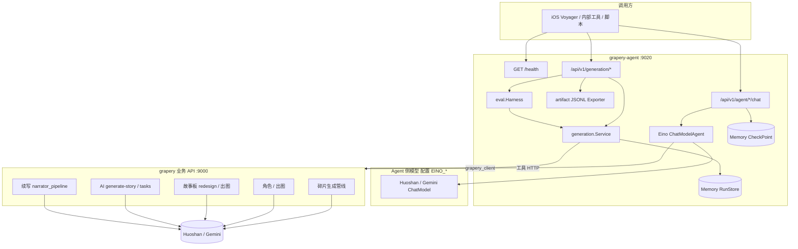
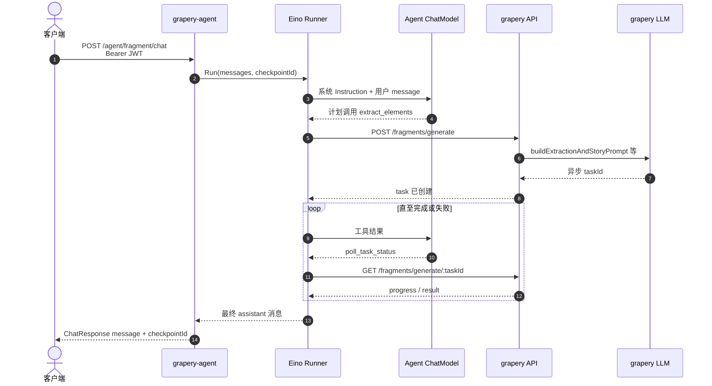
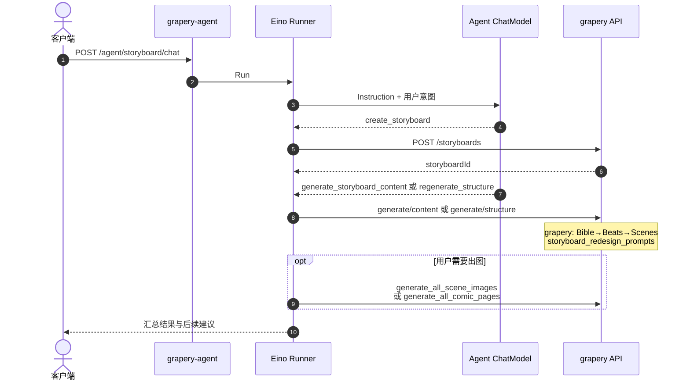
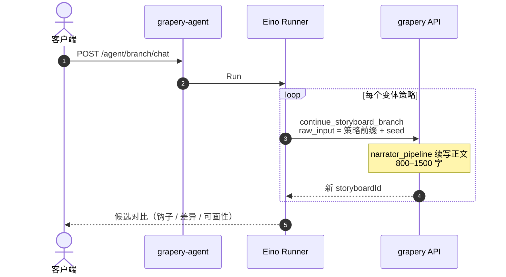
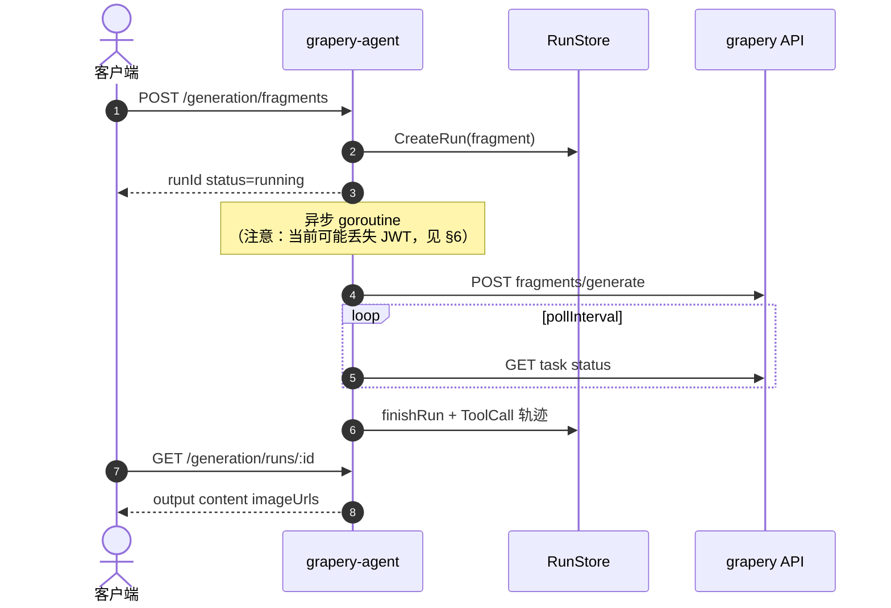
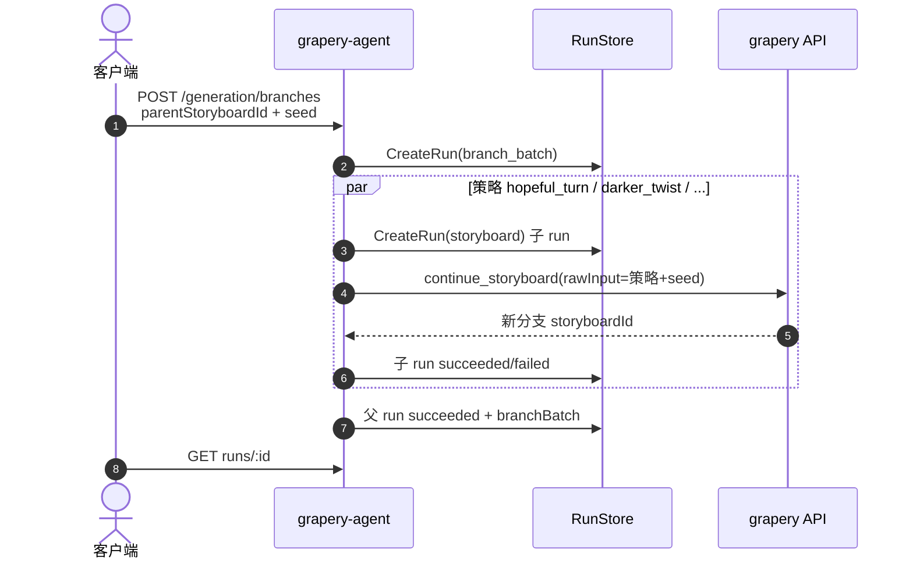

# grapery-agent 功能说明

`grapery-agent` 是与 `grapery` **平行对外**的「聊天 / 生成执行」服务：通过 Eino Agent 提供对话式创作助手，通过 Generation Run API 提供可追踪的批量/异步生成，并为多分支探索与 RL 样本导出预留数据面。
本服务负责路由、工具编排、Run 追踪、内容/图片/视频生成执行、流式推送与按授权进行的用量统计；Agent 侧「产品/流程」说明见 [PROMPT_SYNC.md](./PROMPT_SYNC.md)。

## 0. 服务边界（Parallel Agent Access Token）

> 权威方与执行方分离：**`grapery` 是 auth/quota 权威方**，**`grapery-agent` 是平行对外的聊天/生成执行服务**，`vippay` 保持不变。

- **grapery（控制面）**：用户 JWT 鉴权、活跃用户/会员/限流/额度策略，并签发短期 **Agent Access Token**（`POST /api/v1/agent-access-tokens`）。
- **grapery-agent（执行面）**：校验入站的 Agent Access Token（`X-Agent-Access-Token`），承载聊天/生成流，按 grapery 授权规则读取缓存/专用 API/受控 DB 做用量统计与变更。出站访问 grapery 仍使用转发的用户 JWT（`Authorization: Bearer`）。
- **客户端流程**：① 用 JWT 调 grapery 取 Agent Access Token → ② 携带 `X-Agent-Access-Token` 经 ngx 直连 grapery-agent 的聊天/生成流。
- **Token 契约**：HMAC-SHA256 签名，`iss=grapery`、`aud=grapery-agent`，短期有效（默认 300s），claims 含 `userId/agent/operation/kind/quotaMode/jti/exp` 等。grapery 的 `AGENT_TOKEN_SIGNING_KEY` 必须与 agent 的 `AGENT_TOKEN_VERIFY_KEY` 一致。
- **开关**：grapery `AGENT_PUBLIC_PARALLEL_ENABLED`、`AGENT_TOKEN_REPLAY_CACHE_ENABLED`；agent `AGENT_ACCESS_TOKEN_REQUIRED`（强制校验）。**fragment-panel 为迁移试点**：当 `AGENT_TOKEN_VERIFY_KEY` 已配置时，其聊天/生成端点始终强制 token。
- **审计**：所有迁移到 agent 的生成步骤，需通过 `GenerationStepAudit` 记录提示词、（含失败/重试的）结果与每步 token 用量；失败/重试作为独立 attempt，禁止被成功结果覆盖。

---

## 1. 能力总览

| 类别 | 能力 | 入口 | 是否经过 Eino Agent LLM |
|------|------|------|-------------------------|
| 健康检查 | 服务存活 | `GET /health` | 否 |
| 对话式创作 | 文本故事碎片 | `POST /api/v1/agent/fragment/chat` | 是 |
| 对话式创作 | 参考图多面板碎片 | `POST /api/v1/agent/fragment-panel/chat` | 是 |
| 对话式创作 | 故事角色 | `POST /api/v1/agent/character/chat` | 是 |
| 对话式创作 | 故事板 | `POST /api/v1/agent/storyboard/chat` | 是 |
| 对话式创作 | 多分支探索 | `POST /api/v1/agent/branch/chat` | 是 |
| 人机中断恢复 | 上述四类 `.../chat/:checkpointID/resume` | 同上 | 是 |
| 非聊天生成 | 碎片 / 故事 / 故事板 / 角色 / 分支批 | `POST /api/v1/generation/*` | **否**（直连 grapery API） |
| Run 查询 | 生成任务状态与工具轨迹 | `GET /api/v1/generation/runs/:id` | 否 |
| RL / 评估 | 偏好对、分支选择、JSONL 导出、离线 eval | `POST/GET /api/v1/generation/artifacts/*`、`/eval/*` | 否 |

### 1.1 四个 Chat Agent

| Agent 名称 | 职责 | Agent 版本 ID | 工具包 |
|------------|------|---------------|--------|
| **FragmentCreator** | 文本碎片、增强 prompt、转故事 | `fragment_creator:v1` | `internal/tools/fragment` |
| **FragmentPanelCreator** | 参考图多面板碎片 | `fragment_panel_creator:v1` | `internal/tools/fragment_panel` |
| **CharacterDesigner** | 角色属性/异步任务、碎片候选、头像/肖像/三视图 | `character_designer:v1` | `internal/tools/character` |
| **StoryboardDirector** | 故事板 create+poll、结构重生成、出图、漫画页 | `storyboard_director:v1` | `internal/tools/storyboard` |
| **BranchExplorer** | 平行宇宙分支续写策略 | `branch_explorer:v1` | `internal/tools/branch` |

各 Agent 另挂载公共工具 **`ask_user_feedback`**（人机协作中断）。

### 1.2 非聊天 Generation Run

| Run 类型 `kind` | HTTP | 编排步骤（grapery API） | Agent 版本 |
|-----------------|------|-------------------------|------------|
| `fragment` | `POST /generation/fragments` | `fragments/generate` → 轮询 task | `fragment_creator:v1` |
| `fragment_panel` | `POST /generation/fragment-panels` | `fragment-panels/generate` → 轮询 task | `fragment_panel_creator:v1` |
| `story` | `POST /generation/stories` | `ai/generate-story` → 轮询 AI task | `story_generator:v1` |
| `storyboard` | `POST /generation/storyboards` | `create` → poll redesign → 可选批量出图 | `storyboard_director:v1` |
| `character` | `POST /generation/characters` | 同步 attrs 或 `useAsyncTask` → character-generation-tasks | `character_designer:v1` |
| `branch_batch` | `POST /generation/branches` | 每条策略 `continue_storyboard`（子 run） | `branch_explorer:v1` |

Run 状态：`pending` → `running` → `waiting`（异步）→ `succeeded` | `failed` | `cancelled`。

### 1.3 评估与 RL artifact

| 能力 | API | 说明 |
|------|-----|------|
| 记录 A/B 偏好 | `POST /generation/artifacts/preference-pair` | 写入 `branch_pair_preference` |
| 记录分支胜出 | `POST /generation/artifacts/branch-selection` | 写入 `branch_selection` |
| 导出 JSONL | `GET /generation/artifacts/export` | 目录由 `AGENT_ARTIFACT_DIR` 配置 |
| 离线 eval | `POST /generation/eval/run` | 按 seed 触发真实 grapery 生成（慎用生产） |
| Eval seeds 列表 | `GET /generation/eval/seeds` | 内置种子定义 |

---

## 2. 系统架构（流程图）



**要点**

- **Chat 路径**：Agent LLM（Eino）决定调哪些工具；工具内部请求 **grapery**，由 grapery 再调业务 LLM。
- **Generation 路径**：不调用 Eino Agent，仅 **API 编排 + 轮询 + ToolCall 记录**。
- **RunStore / CheckPoint**：当前为进程内内存，重启丢失（见 §6 限制）。

---

## 3. Chat 模式时序图

### 3.1 碎片创作（FragmentCreator）



可选分支：`enhance_prompt` → `poll_ai_task`；完成后 `prefill_story` / `convert_to_story`；敏感决策 `ask_user_feedback` → `resume`。

### 3.2 故事板（StoryboardDirector）



### 3.3 多分支 Chat（BranchExplorer）



---

## 4. Generation Run 时序图

### 4.1 碎片非聊天生成



### 4.2 分支批量（branch_batch）



默认策略轴定义见 `internal/prompt/branch_strategies.go`。

---

## 5. HTTP API 一览

### 5.1 认证与公共 Header

| Header | 说明 |
|--------|------|
| `Authorization: Bearer <JWT>` | 转发至 grapery（与 Voyager 用户态一致） |
| `X-Generation-Run-Id` | 可选；注入 context，工具轨迹归属该 run |

### 5.2 Agent Chat

| 方法 | 路径 | Body |
|------|------|------|
| POST | `/api/v1/agent/fragment/chat` | `{ "message", "interruptId?" }` |
| POST | `/api/v1/agent/fragment/chat/:checkpointID/resume` | 同上 |
| POST | `/api/v1/agent/character/chat` | 同上 |
| POST | `/api/v1/agent/character/chat/:checkpointID/resume` | 同上 |
| POST | `/api/v1/agent/storyboard/chat` | 同上 |
| POST | `/api/v1/agent/storyboard/chat/:checkpointID/resume` | 同上 |
| POST | `/api/v1/agent/branch/chat` | 同上 |
| POST | `/api/v1/agent/branch/chat/:checkpointID/resume` | 同上 |

Query：`?stream=true` 启用流式（Eino streaming）。

响应字段：`message`、`finished`、`interrupted`、`question`、`interruptId`、`checkpointId`。

### 5.3 Generation

| 方法 | 路径 | 主要 Body 字段 |
|------|------|----------------|
| POST | `/api/v1/generation/fragments` | `userInput`, `referenceImages`, `imageCount`, `style`, `mood`, `consistencyLevel`, … |
| POST | `/api/v1/generation/stories` | `prompt`, `context`, `characters`, `style`, `length` |
| POST | `/api/v1/generation/storyboards` | `storyId`, `rawInput`, `sceneCount`, `generateImages`, `useComicPagePipeline`, … |
| POST | `/api/v1/generation/characters` | `storyId`, `prompt`, `name`, `createRecord`, `generatePortrait`, … |
| POST | `/api/v1/generation/branches` | `parentStoryboardId`, `seedPrompt`, `branchCount`, `strategies`, … |
| GET | `/api/v1/generation/runs/:id` | — |
| GET | `/api/v1/generation/runs?kind=&limit=` | — |
| POST | `/api/v1/generation/artifacts/preference-pair` | `prompt`, `branchA`, `branchB`, `preferred` |
| POST | `/api/v1/generation/artifacts/branch-selection` | 胜出/淘汰分支 ID |
| GET | `/api/v1/generation/artifacts/export` | — |
| POST | `/api/v1/generation/eval/run` | agent 版本、seed、waitSec |
| GET | `/api/v1/generation/eval/seeds` | — |

统一成功包装：`{ "code": 1, "message": "success", "data": ... }`。

### 5.4 Agent 工具清单（Chat 可调）

**FragmentCreator**

| 工具名 | 作用 |
|--------|------|
| `extract_elements` | 启动碎片生成异步任务 |
| `poll_task_status` | 查询碎片任务 |
| `cancel_task` | 取消任务 |
| `enhance_prompt` | 增强用户描述 |
| `poll_ai_task` | 查询通用 AI 任务 |
| `generate_image` | 独立出图 |
| `convert_to_story` | 碎片转故事 |
| `prefill_story` | 转故事前 AI 建议 |
| `ask_user_feedback` | 人机协作 |

**CharacterDesigner**

| 工具名 | 作用 |
|--------|------|
| `generate_character_attrs` | AI 生成 10 字段属性 |
| `create_character` | 写入故事角色 |
| `generate_portrait` | 全身肖像 |
| `generate_three_views` | 三视图 |
| `generate_avatar` | 头像 |
| `ask_user_feedback` | 人机协作 |

**StoryboardDirector**

| 工具名 | 作用 |
|--------|------|
| `create_storyboard` | 创建故事板 |
| `generate_storyboard_content` | 生成正文与场景（content 步） |
| `regenerate_structure` | 重新 Bible/场景结构 |
| `generate_scene_image` / `generate_all_scene_images` | 单场景 / 批量出图 |
| `generate_comic_page` / `generate_all_comic_pages` | 漫画页拼贴管线 |
| `generate_scene_video` | 场景视频 |
| `continue_storyboard` | 续写分支 |
| `get_generation_progress` | 查询生成进度 |
| `ask_user_feedback` | 人机协作 |

**BranchExplorer**

| 工具名 | 作用 |
|--------|------|
| `continue_storyboard_branch` | 带策略标签的续写 |
| `ask_user_feedback` | 人机协作 |

---

## 6. 提示词对照表

说明列：

- **Agent Instruction**：`internal/prompt/*_domain.go`，供 Eino Agent 编排与解释，**不直接调用业务 LLM**。
- **grapery 权威 Prompt**：实际生成时由 grapery 拼装并调用 Huoshan/Gemini。
- **Role**：`orchestration` = Agent 浓缩版；`strategy` = 仅 agent 分支轴；`reference` = 仅文档登记、无完整 Agent 文案。

| 业务 | Agent 版本 | Agent Instruction 位置 | grapery 权威 Prompt | Role | Agent 覆盖摘要 | grapery 独有（未写入 Agent） |
|------|------------|--------------------------|---------------------|------|----------------|------------------------------|
| 文本故事碎片 | `fragment_creator:v1` | `FragmentIntro` + `FragmentDomainKnowledge` | `fragment_generation_service.go` → `buildExtractionAndStoryPrompt` | orchestration | 元素质量标准、八层 imagePrompt、转故事 handoff | scene 扩写细节、comic style 命名 |
| 参考图多面板碎片 | `fragment_panel_creator:v1` | `FragmentPanelIntro` + `FragmentPanelDomainKnowledge` | `fragment_panel_plan_prompts.go` | orchestration | panel plan、visualBible、参数决策 | Huoshan 组图出图细节 |
| 故事角色 | `character_designer:v1` | `CharacterIntro` + `CharacterDomainKnowledge` | `character.go` → `GenerateCharacterWithAI` | orchestration | 10 字段、async task tools、碎片候选 | strict JSON 在 grapery |
| 故事板 | `storyboard_director:v1` | `StoryboardIntro` + `StoryboardDomainKnowledge` | `storyboard_redesign_prompts.go`（主）；`storyboard.go`（旧） | orchestration + reference | create→poll 主路径、comicFunction、panelShape | 完整 JSON schema；comic page 出图细节 |
| 多分支 | `branch_explorer:v1` | `BranchIntro` + `BranchDomainKnowledge` | `narrator_pipeline.go` 续写 | strategy + reference | 策略轴、差异化约束、`BuildBranchRawInput` | FateSnapshot、800–1500 字正文、场景 JSON 规划 |
| 故事文本 | `story_generator:v1` | **无 Chat Agent** | `story.go` enrich；`ai_handler.go` `generate-story` | reference | — | 无 StoryCreator instruction |
| 分支策略文案 | — | `branch_strategies.go` | （作为 `continue` 的 `rawInput` 前缀） | strategy | hopeful_turn / darker_twist / comedic_detour / mystery_reveal | 完整 narrator 上下文 |

### 6.1 分支策略与续写前缀

| 策略 ID | 中文前缀意图 | 元数据 hook |
|---------|--------------|-------------|
| `hopeful_turn` | 局势意外转机、压抑→微弱希望 | 治愈/共鸣向 |
| `darker_twist` | 更黑暗不可逆转折，须来自前文伏笔 | 悬疑/冲击向 |
| `comedic_detour` | 荒诞合理喜剧插曲 | 轻松/传播向 |
| `mystery_reveal` | 揭露隐藏信息、「原来如此」 | 烧脑/讨论向 |

### 6.2 漂移检测

修改 grapery prompt 后执行：

```bash
cd grapery-agent && go test ./internal/prompt/ -run TestGraperyPromptAnchors
```

详见 [PROMPT_SYNC.md](./PROMPT_SYNC.md)。

---

## 7. 配置与环境

| 变量 | 默认 / 说明 |
|------|-------------|
| `SERVER_PORT` | `9020` |
| `GRAPERY_BASE_URL` | grapery 根地址，如 `http://localhost:9000` |
| `GRAPERY_API_KEY` | 可选；无 JWT 时用于服务端调用 |
| `AGENT_ARTIFACT_DIR` | RL JSONL 导出目录 |
| `EINO_TEXT_PROVIDER` | `huoshan` 或 `gemini`（Agent ChatModel） |
| `EINO_TEXT_MODEL` | 模型 endpoint / 名称 |
| `EINO_MAX_ITERATIONS` | Agent 最大工具循环次数，默认 30 |
| `HUOSHAN_API_KEY` / `HUOSHAN_BASE_URL` | Agent 侧火山配置 |
| `GEMINI_API_KEY` | Agent 侧 Gemini 备选 |

---

## 8. 代码目录速查

| 路径 | 职责 |
|------|------|
| `cmd/server/main.go` | 启动 Gin、注册 Agent + Generation |
| `internal/agents/` | 四个 ChatModelAgent 注册 |
| `internal/tools/*/` | Eino 工具 → grapery_client |
| `internal/generation/` | 非聊天 Run 编排 |
| `internal/runstore/` | Run / ToolCall / Artifact 内存存储 |
| `internal/prompt/` | Agent Instruction 与 grapery 对照 catalog |
| `internal/grapery_client/` | grapery HTTP 封装 |
| `internal/eval/` | 离线 eval harness |
| `internal/artifact/` | JSONL 导出 |
| `docs/PROMPT_SYNC.md` | 提示词维护流程 |

---

## 9. 已知限制（当前实现）

1. **双路径提示词**：Chat 用 Agent Instruction；生成质量由 grapery prompt 决定，两处需人工/sync 测试对齐（见 PROMPT_SYNC）。
2. **Generation 异步 JWT**：`Start*` 多在 `context.Background()` 中执行，若未配置 `GRAPERY_API_KEY`，异步阶段可能丢失用户 JWT。
3. **内存存储**：Run、Checkpoint 重启清空；无 cancel/retry HTTP API（domain 已预留 `cancelled`）。
4. **故事板 Run**：默认在 `generate/content` 提交后即 `succeeded`，未必等待异步内容/出图完成（除非 `pollProgress` / 单独查询 grapery）。
5. **分支批处理**：部分子分支失败时父 run 仍可能标记成功。
6. **无 Story Chat Agent**：故事仅 `generation/stories` + grapery AI 任务。
7. **Eval**：会触发真实 grapery 生成，仅建议在测试环境使用。

---

## 10. 相关文档

- [PROMPT_SYNC.md](./PROMPT_SYNC.md) — Agent ↔ grapery 提示词维护与对照细节
- `internal/domain/contracts.go` — 与 grapery HTTP API 的字段注释映射
